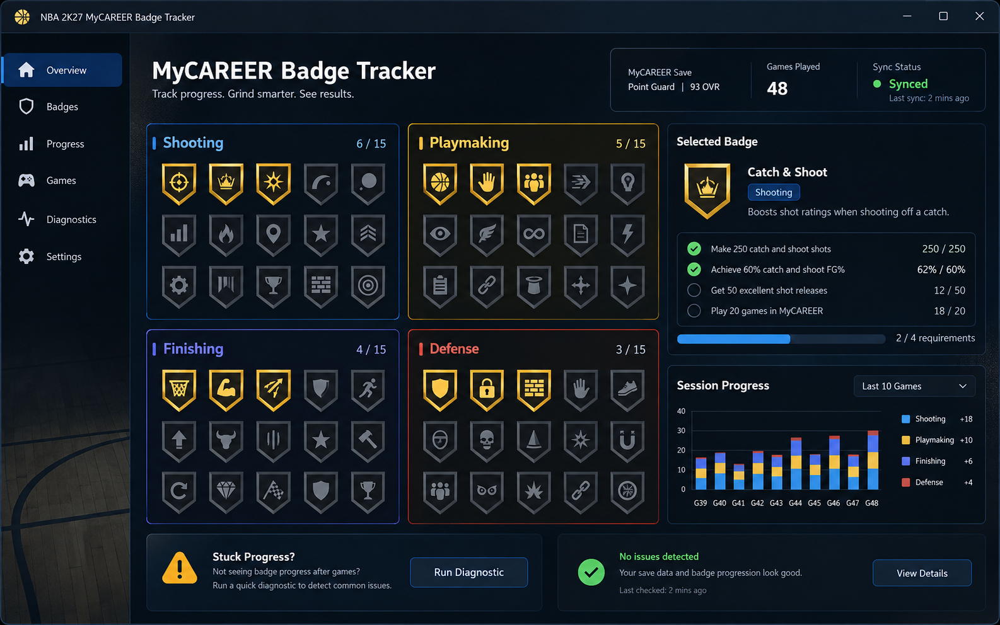

# NBA 2K27: planejador de badges MyCAREER

Compare requisitos de badges, atributos e progresso registrado. Planeje melhorias sem promessas de desbloqueio ou alteração de dados do servidor.

<a href="./README.md">English</a> · <a href="./README_ES.md">Español</a> · <a href="./README_PT.md">Português</a> · <a href="./README_DE.md">Deutsch</a> · <a href="./README_FR.md">Français</a> · <a href="./README_CN.md">简&#8288;体&#8288;中&#8288;文</a> · <a href="./README_TW.md">繁&#8288;體&#8288;中&#8288;文</a> · <a href="./README_JP.md">日&#8288;本&#8288;語</a> · <a href="./README_KR.md">한&#8288;국&#8288;어</a>

  

## Por que esta ferramenta existe

Compare requisitos de badges, atributos e progresso registrado. Planeje melhorias sem promessas de desbloqueio ou alteração de dados do servidor.

O repositório contém documentação e um conceito de interface, não uma versão funcional verificada. Notas e imagens não são testes de execução nem comprovam autoria oficial, compatibilidade ou proteção da conta.

## Conheça a interface

- **01.** Grade de emblemas agrupada por finalização, chute, armação e defesa.
- **02.** Lista de verificação de requisitos para o selo selecionado.
- **03.** Gráfico de sessão vinculando jogos concluídos ao progresso visível.
- **04.** Status de sincronização com a última atualização bem-sucedida.
- **05.** Diagnóstico de um requisito ou sessão que não foi registrado.

## Visão rápida

| Recurso | Resultado |
|---|---|
| **Entrada** | Histórico de sessões ou partidas |
| **Resultado** | Visualização de progresso e tendência |
| **Saída** | Exportação de história local |

## O que ele faz

- **lista de verificação de requisitos de crachá.** Transforma sessões concluídas em um progresso legível ou histórico de partidas.

- **Acompanhamento de sessão MyCAREER.** Divide os totais em categorias que explicam onde o progresso foi ganho ou perdido.

- **diagnóstico de progresso e sincronização.** Registra o tempo de sincronização e as sessões ignoradas para que os dados ausentes possam ser diagnosticados.

## Como interpretar o resultado

Uma tendência precisa de várias sessões concluídas e de um tempo de sincronização confiável. Leia os ganhos recentes ao lado dos requisitos ou combine os detalhes que os produziram. Se faltar uma entrada, evite editar os totais manualmente até que a fonte bruta confirme se a sessão estava incompleta, atrasada ou duplicada.

## Antes de começar

- Deixe **Histórico de sessões ou partidas** pronto e confirme que pertence ao perfil ou sessão de NBA 2K27 desejado.
- Anote a build atual do jogo/cliente ou a data dos dados antes de alterar um perfil.
- Escolha onde **Exportação de história local** será salvo para não substituir o resultado anterior.
- Teste **lista de verificação de requisitos de crachá** primeiro em uma sessão curta e mantenha o save, perfil ou comparação original ao lado.

## Primeira execução completa

1. Abra **NBA 2K27: planejador de badges MyCAREER** e confira a build ou a fonte de dados de NBA 2K27.
2. Escolha a entrada ou o perfil e ajuste **lista de verificação de requisitos de crachá** sem alterar os padrões que não fazem parte do teste.
3. Confira **Acompanhamento de sessão MyCAREER** na prévia ou no painel de status e corrija alertas de versão, filtro ou detecção.
4. Execute uma ação controlada. Compare o resultado visível com a prévia antes de mudar outro ajuste.
5. Salve o perfil ou exporte o resultado, mantendo **diagnóstico de progresso e sincronização** disponível para comparação e recuperação.

## Solução de problemas

> **Falha comum:** o progresso do emblema não é atualizado após um jogo.

### Uma sessão recente está faltando

Compare o horário da última sincronização com a correspondência concluída e atualize apenas a fonte de dados selecionada.

### O progresso permanece inalterado

Abra a lista de verificação de requisitos e confirme se a sessão atendeu à condição monitorada.

### A sobreposição mostra totais antigos

Recarregue o layout depois que a visualização do histórico terminar a sincronização.

## Feito para

- Revise uma sessão
- Encontre o progresso que falta
- Assista a um resumo compacto do jogo

## Depois de uma atualização do jogo

- [ ] Confirme se a fonte de dados informa a nova temporada ou versão do jogo.
- [ ] Aguarde uma sessão concluída e compare seu carimbo de data/hora com o painel de sincronização.
- [ ] Verifique os campos de requisitos e correspondência antes de assumir que falta progresso.
- [ ] Mantenha a última exportação pré-atualização até que as novas entradas do histórico permaneçam estáveis.

## Perguntas frequentes

<strong>O que incluir no registro de compatibilidade?</strong>

Anote a versão exata do jogo e da ferramenta ou dados, a entrada usada e o resultado observado. Identifique campos desconhecidos; um teste em outra versão não comprova a atual.

<strong>Há um executável ou script funcional incluído?</strong>

O repositório contém documentação e um conceito de interface, não uma versão funcional verificada. Notas e imagens não são testes de execução nem comprovam autoria oficial, compatibilidade ou proteção da conta.

## Dados e recuperação

O histórico permanece local até que você o exporte. Preserve os carimbos de data/hora brutos da sessão para que uma entrada ausente ou duplicada possa ser corrigida sem adivinhação.

Use automação e modificações apenas quando as regras do jogo e o tipo de sessão permitirem.

---

## Baixar

Confira o escopo e a compatibilidade documentados antes de escolher uma versão.

---

Conceito de interface gerado por IA; uma versão funcional ainda não foi verificada.

